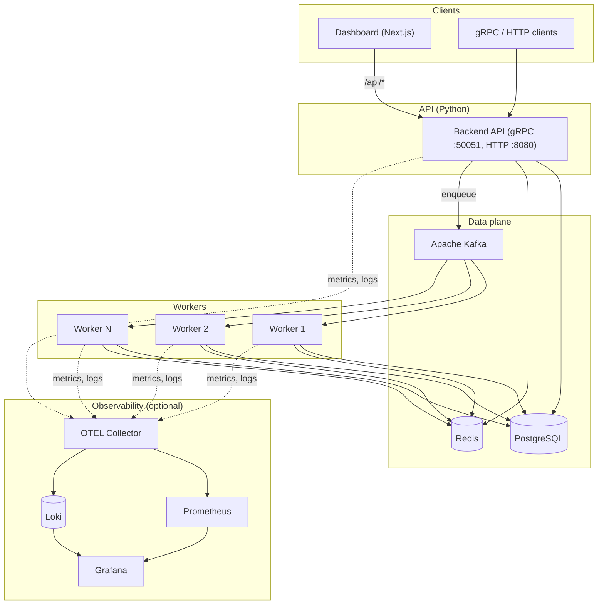

# Distributed Task Queue

A highly available task queue system with **priority scheduling**, **retry logic**, and **real-time monitoring**. Designed for **10M+ tasks/day**, **zero downtime**, and **sub-ms P99** latency.

## Architecture

- **API:** Python gRPC service (task submission, status, scheduling)
- **Broker:** Apache Kafka (task distribution, priority queues)
- **Primary DB:** PostgreSQL (task metadata, state, history)
- **Cache:** Redis (hot path cache, rate limits, deduplication)
- **Workers:** Python Kafka consumers, orchestrated on Kubernetes
- **Monitoring:** Prometheus + Grafana + OpenTelemetry (tracing) + Loki (logs)
