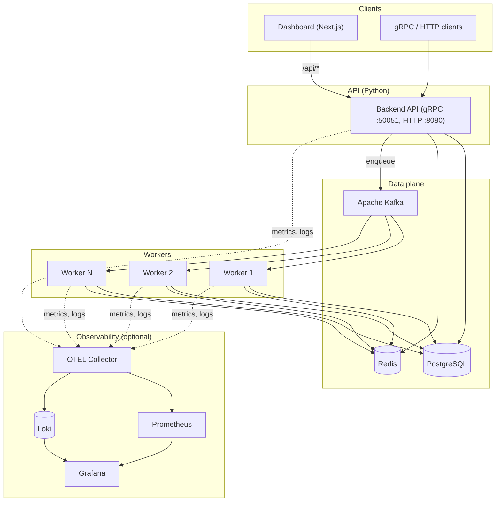

# Distributed Task Queue

A highly available task queue system with **priority scheduling**, **retry logic**, and **real-time monitoring**. Designed for **10M+ tasks/day**, **zero downtime**, and **sub-ms P99** latency.

## Architecture



- **API:** Python gRPC service (task submission, status, scheduling)
- **Broker:** Apache Kafka (task distribution, priority queues)
- **Primary DB:** PostgreSQL (task metadata, state, history)
- **Cache:** Redis (hot path cache, rate limits, deduplication)
- **Workers:** Python Kafka consumers, orchestrated on Kubernetes
- **Monitoring:** Prometheus + Grafana + OpenTelemetry (tracing) + Loki (logs)

## Quick Start

### Prerequisites

- **Containers:** Docker or Podman (with Compose)
  - Docker: [Docker Engine](https://docs.docker.com/engine/install/) and Compose plugin (`docker compose`)
  - Podman: [Podman](https://podman.io/) and [Compose](https://github.com/containers/podman-compose) (`podman compose` or `podman-compose`)
- Python 3.11+
- Node.js 20+
- (Optional) kubectl + Kubernetes cluster for production

### Local Development

1. **Start infrastructure first** (required: Kafka, PostgreSQL, Redis). Without this, the API will exit with a clear error.

   **Docker:**

   ```bash
   docker compose up -d
   ```

   **Podman:** (same compose file)

   ```bash
   podman compose up -d
   ```

   Or with standalone podman-compose: `podman-compose up -d`

   **Either runtime** (auto-detects Docker vs Podman):

   ```bash
   ./compose.sh up -d
   ```

   Using your own PostgreSQL? See [docs/POSTGRES_SETUP.md](docs/POSTGRES_SETUP.md) to create the `taskqueue` user and database.

2. **Backend API** (gRPC :50051, HTTP dashboard API :8080, metrics :9090):

   ```bash
   cd backend && pip install -e . && python -m taskqueue.api.server
   ```

3. **Workers** (separate terminal):

   ```bash
   cd workers && pip install -r requirements.txt && PYTHONPATH=src python -m worker.run
   ```

4. **Dashboard** (Next.js, proxies `/api/*` to backend :8080):

   ```bash
   cd dashboard && npm install && npm run dev
   ```

   Open <http://localhost:3000>. Ensure the backend is running on port 8080 so the dashboard can load stats and submit tasks.

**Problems?** See [docs/TROUBLESHOOTING.md](docs/TROUBLESHOOTING.md) (Postgres role, metrics port, Kafka).

### Production (Kubernetes)

```bash
kubectl apply -f k8s/
```

### Compose commands (Docker or Podman)

Use `docker compose`, `podman compose`, or `./compose.sh`:

| Action                 | Command                               |
|------------------------|---------------------------------------|
| Start                  | `up -d`                               |
| Stop                   | `down`                                |
| Stop + remove volumes  | `down --volumes` or `down -v`         |
| Logs                   | `logs -f`                             |
| Build images           | `build`                               |

**Stopping the API / Workers / Dashboard:** Press **Ctrl+C** in each terminal where they run.

**Stopping infrastructure:** Run from the **project root** (where `docker-compose.yml` is). Use the same command style you used to start:

- `./compose.sh down` or `./compose.sh down --volumes`
- With Podman plugin: `podman compose down` or `podman compose down --volumes`
- With standalone podman-compose: `podman-compose down` or `podman-compose down -v`

If `down` doesn’t stop containers, run from project root and try `./compose.sh down -v`. To force-remove leftovers: `podman ps -a`, then `podman rm -f <container_id>`.

On Podman, if the API or workers on the host cannot reach Kafka/Postgres/Redis, ensure the host can reach container ports (e.g. use `--network host` for services that need host access, or connect to `host.containers.internal` where supported).

## Testing

### 0. Automated test suites (pytest + Jest)

**Backend** (from repo root):

```bash
cd backend && pip install -e ".[dev]" && pytest tests -v
```

**Workers:**

```bash
cd workers && pip install -e ".[dev]" && pytest tests -v
```

**Dashboard:**

```bash
cd dashboard && npm ci && npm run test
```

**CI:** GitHub Actions runs all three test suites on push/PR to `main` (see [.github/workflows/tests.yml](.github/workflows/tests.yml)).

**Linting and pre-commit:** From the repo root (with a Git checkout), install and run [pre-commit](https://pre-commit.com/):

```bash
pip install pre-commit
pre-commit install # install git hooks (run on commit)
pre-commit run --all-files # run all hooks once
```

Hooks include Ruff (lint + format), trailing whitespace, end-of-file fixer, YAML/JSON checks, and large-file check. CI runs the same checks in [.github/workflows/pre-commit.yml](.github/workflows/pre-commit.yml).

### 1. Manual test (dashboard)

With infrastructure, API, workers, and dashboard running:

1. Open **<http://localhost:3000>**.
2. In **Submit task**, set Queue (e.g. `default`), Payload (e.g. `{"hello": "world"}`), Priority (e.g. `5`), then click **Submit**.
3. Note the returned **Task ID**.
4. In **Recent tasks**, the task should appear; after a few seconds its status should change from QUEUED → RUNNING → SUCCESS.
5. **Queue stats** should update (e.g. completed count increases).

### 2. Test via HTTP API (curl)

With the **backend** running (port 8080):

**Submit a task:**

```bash
curl -s -X POST http://localhost:8080/api/submit \
  -H "Content-Type: application/json" \
  -d '{"queue":"default","payload":"{\"test\":true}","priority":5}'
```

You should get something like: `{"task_id":"<uuid>","status":"QUEUED"}`.

**Get queue stats:**

```bash
curl -s http://localhost:8080/api/stats
```

**List recent tasks:**

```bash
curl -s "http://localhost:8080/api/tasks?limit=5"
```

### 3. Submit and poll until done (script)

From project root, with API and worker running:

```bash
# Submit
RES=$(curl -s -X POST http://localhost:8080/api/submit \
  -H "Content-Type: application/json" \
  -d '{"queue":"default","payload":"{}","priority":5}')
TASK_ID=$(echo "$RES" | python3 -c "import sys,json; print(json.load(sys.stdin).get('task_id',''))")
echo "Task ID: $TASK_ID"

# Poll status every 2s (up to 10 times)
TASK_ID=$(echo "$RES" | python3 -c "import sys,json; print(json.load(sys.stdin).get('task_id',''))")
for _ in 1 2 3 4 5 6 7 8 9 10; do
  STATUS=$(curl -s "http://localhost:8080/api/tasks?limit=20" | python3 -c "import sys,json; d=json.load(sys.stdin); tid=sys.argv[1]; print(next((t.get('status','') for t in d.get('tasks',[]) if t.get('task_id')==tid), '')" "$TASK_ID")
  echo "Status: $STATUS"
  case "$STATUS" in SUCCESS|FAILED|CANCELLED) break ;; esac
  sleep 2
done
```

### 4. Scale testing

With **infrastructure**, **backend**, and **workers** running:

**Submit many tasks (no wait):**

```bash
python3 scripts/scale_test.py --count 500 --concurrency 20
```

**Submit and wait for completion (reports throughput and latency):**

```bash
python3 scripts/scale_test.py --count 200 --concurrency 10 --wait
```

By default each task gets a distinct payload `{"scale_test": true, "index": i}` so payloads appear in the dashboard. Use `--payload '{"key":"value"}'` to use one payload for all tasks. Other options: `--base-url`, `--queue`, `--priority`, `--poll-interval`, `--poll-timeout`. Uses only Python stdlib.

**How many tasks run at once / throughput:**

- Each worker process runs **one task at a time** (processes one Kafka message, then the next). So **tasks running concurrently = number of worker processes** (e.g. 1 with a single worker, 5 with five processes or replicas).
- **Throughput** ≈ (number of worker processes) ÷ (average task duration). With the default worker payload (no `delay_ms`), a task is a few DB round-trips and finishes in milliseconds — you can see tens to low hundreds of completions per second per worker. If you use payloads with `delay_ms` (e.g. `{"delay_ms": 100}`), throughput drops accordingly (e.g. ~10/s per worker at 100 ms per task).
- The scale test’s `--concurrency` controls only **submit** concurrency (how many HTTP requests in flight when pushing tasks), not how many tasks run at once on workers.

**Scaling workers:**

- **Local:** Run multiple worker processes (e.g. open several terminals and run `python -m worker.run` in each). Each process consumes from Kafka; partition count limits how many consumers can share the topic (use at least as many partitions as worker processes for even distribution).
- **Kubernetes:** Scale the worker deployment: `kubectl scale deployment/worker -n taskqueue --replicas=5`. Kafka topic partitions (see `k8s/kafka.yaml`) should be ≥ number of replicas.

### 5. Monitoring

- **Prometheus:** <http://localhost:9090> — scrape metrics from API (9090) and workers (9091). See [docs/MONITORING.md](docs/MONITORING.md) for what to query and how.
- **Grafana:** <http://localhost:3000> — login `admin` / `admin`, open the **Task Queue** dashboard (Prometheus datasource). If the Next.js dashboard also uses 3000, run it on another port (e.g. `PORT=3001 npm run dev`).
- **Loki:** <http://localhost:3100> — log store; query from Grafana Explore. By default no app logs are sent to Loki; see [docs/MONITORING.md](docs/MONITORING.md) for details.

## Project Layout

```text
backend/          # gRPC API, DB, Kafka producer, scheduler, retry
workers/          # Kafka consumers (task execution)
dashboard/        # Next.js + React UI
k8s/              # Kubernetes manifests
docker-compose.yml
compose.sh        # Run compose with Docker or Podman
```

## API (gRPC)

- `SubmitTask` – Enqueue task with priority and options
- `GetTask` / `ListTasks` – Query task status
- `CancelTask` – Cancel pending/running task
- `GetQueueStats` – Queue depth, throughput, P99

## Metrics & Observability

- **Prometheus:** `taskqueue_*` metrics (throughput, latency, queue depth)
- **Grafana:** Pre-built dashboards in `monitoring/grafana/`
- **OpenTelemetry:** Traces for submit → Kafka → worker → DB
- **Loki:** Structured logs from API and workers
